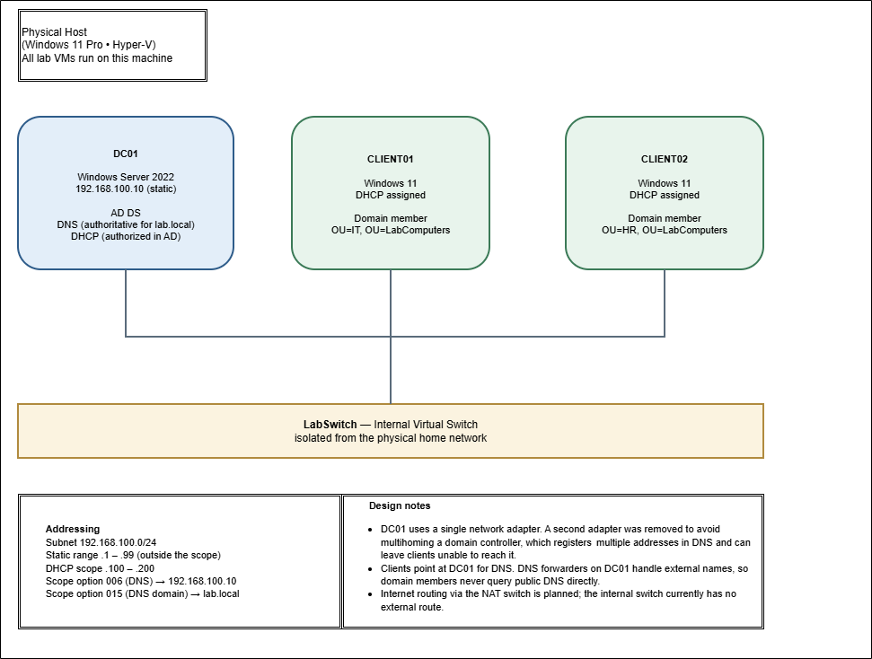

# Active Directory Home Lab

A Windows Server domain built from scratch in Hyper-V to practice and document core system administration work: Active Directory, DNS, DHCP, Group Policy, PowerShell automation, and security hardening.

Every configuration step in this lab was performed and documented in PowerShell or Group Policy rather than through one-off GUI wizards, so the build is repeatable and the reasoning behind each step is recorded. Security controls are mapped to recognized frameworks (CIS Controls, NIST CSF, SOC 2) so the work reads as production practice, not just "it works."

---

## Environment

| Role | Hostname | Address | OU |
|---|---|---|---|
| Domain controller | DC01 | 192.168.100.10 (static) | Domain Controllers |
| Windows 11 client | CLIENT01 | DHCP assigned | LabComputers\IT |
| Windows 11 client | CLIENT02 | DHCP assigned | LabComputers\HR |

- **Hypervisor:** Hyper-V on Windows 11 Pro
- **Virtual switch:** Internal, isolated from the physical home network
- **Domain:** lab.local
- **Subnet:** 192.168.100.0/24
- **DHCP scope:** 192.168.100.100 – 192.168.100.200
- **Static range:** 192.168.100.1 – .99 reserved outside the scope



---

## What Is Built

**Active Directory Domain Services**
Forest and domain promoted on DC01. Integrated DNS installed automatically with the role. All FSMO roles held by DC01.

**DNS**
Authoritative for lab.local. Forwarders configured for external resolution, though these are currently inactive by design — see Notes on Scope below.

**DHCP**
Role installed and authorized in Active Directory. Scope configured with option 006 (DNS server) and option 015 (DNS domain name), so clients receive the correct DNS server automatically and can join the domain without per-machine configuration. Dynamic DNS registration runs under a dedicated least-privilege service account (`svc-dhcpdns`), remediating the Event 1056 finding. Configuration exported to XML as a backup.

**Organizational unit structure**
Users and computers are organized in separate OU branches, each subdivided by department:

```
lab.local
├── OU=LabUsers
│   ├── OU=IT, OU=HR, OU=Finance, OU=Operations
├── OU=LabComputers
│   ├── OU=IT, OU=HR, OU=Finance, OU=Operations
└── OU=ServiceAccounts
```

Objects are placed in OUs rather than the default `CN=Users` and `CN=Computers` containers, because Group Policy Objects cannot be linked to a container. Users and computers are separated because every GPO contains a Computer Configuration and a User Configuration section, applied according to where each object type sits — user settings follow the person to whatever machine they log into, while computer settings stay with the machine regardless of who uses it.

**Domain-joined clients**
Two Windows 11 clients joined to lab.local, receiving addressing and DNS automatically from DHCP, and placed in separate department OUs so that Group Policy scoping can be demonstrated and verified across different targets.

**Bulk user provisioning**
`New-LabUsers.ps1` reads a CSV, generates usernames from first initial plus last name, checks for existing accounts before creating, places each user in the OU matching their department, forces a password change at first logon, and adds each account to its department security group. The script is idempotent — re-running it skips existing accounts rather than erroring or creating duplicates. Verified end to end across 25 users (20 created, 5 pre-existing skipped) by logging into a client with a provisioned account and confirming the forced password change.

**Security groups and group-based access**
Global security groups per department (`IT-Users`, `HR-Users`, `Finance-Users`, `Operations-Users`) plus a cross-cutting `IT-RemoteAccess` group. Group membership drives access rather than per-user assignment, so entitlements are managed by adding or removing a single group member — the least-privilege / role-based model.

**Pre-staged computer objects**
`New-LabComputers.ps1` pre-stages department computer accounts in the matching computer OUs (department prefixes kept under the 15-character NetBIOS limit), so Group Policy targeting and OU structure can be demonstrated at realistic scale without building a VM per object. Real vs. placeholder objects are distinguishable by their populated `DNSHostName`.

**Group Policy**
- **IT - Local Remote Access** (linked to `OU=IT,OU=LabComputers`) — pushes `IT-RemoteAccess` into the local Remote Desktop Users group via a Local Users and Groups preference, and enables RDP. This delivers remote-access rights by group membership without touching each machine.
- **Workstation Firewall Baseline** (linked to `OU=LabComputers`) — Windows Defender Firewall on for all profiles, default-deny inbound with allow-by-exception, RDP scoped to the management source address, connection encryption required at High with Network Level Authentication enforced, idle/disconnected session limits, and firewall logging (dropped + allowed) enabled.
- Verified on clients with `gpresult` and confirmed applied in the firewall `ActiveStore`.

**RDP connectivity remediation (troubleshooting case study)**
A persistent one-way reachability failure — DC01 could not reach CLIENT01 on ICMP or TCP 3389 despite correct allow rules — was resolved by systematic, layer-by-layer elimination (client firewall → IP → virtual switch → L2/ARP → DC adapter/stack), then a `pktmon` capture that localized the drop to the Windows Filtering Platform, and finally a `wfpdiag` state dump that **named the exact filter and its provider**: a "Shielded Main Rule" installed by the built-in firewall in shields-up mode, overriding the allow rules. Fixed at the GPO (not the client), then verified with a positive test (in-scope source succeeds) and a negative test (out-of-scope source correctly refused). Full write-up: [RDP connectivity remediation & firewall hardening](docs/RDP_Firewall_Remediation.md).

---

## Security & Compliance

Firewall and access-control decisions in this lab are deliberately mapped to recognized security frameworks, so each configuration is a named control rather than an ad-hoc setting:

- **Deny-by-default inbound, allow by exception** — CIS Control 4/13 · NIST CSF PR.PS · SOC 2 CC6.6
- **Remote access scoped to a management source** — CIS 12 · NIST CSF PR.AA · SOC 2 CC6.1
- **Least-privilege, group-based access** — CIS 6 · SOC 2 CC6.1–6.3
- **NLA + High encryption for remote sessions** — CIS 3/6 · SOC 2 CC6.7
- **Firewall logging (detection/audit trail)** — CIS 8 · NIST CSF DE.CM · SOC 2 CC7.2
- **GPO-enforced baseline (single source of truth)** — CIS 4 · SOC 2 CC8.1

A full control → implementation → verification crosswalk (including secondary mappings to NIST 800-171, PCI DSS, and HIPAA) is in the [RDP remediation write-up](docs/RDP_Firewall_Remediation.md). These are *technical controls demonstrated*, not a compliance certification.

---

## Documentation

| Document | Contents |
|---|---|
| [Domain controller and Active Directory](docs/DC01_Powershell.md) | OU structure, security groups, bulk provisioning, computer pre-staging, and domain joins |
| [DHCP installation and configuration](docs/DHCP_Powershell.md) | DHCP role, scope, options, forwarders, service-account remediation, and backup |
| [Group Policy](docs/GroupPolicy.md) | Remote-access and firewall-baseline GPOs, RDP scoping/NLA/encryption/logging, and verification |
| [RDP remediation & firewall hardening](docs/RDP_Firewall_Remediation.md) | Diagnostic methodology, root cause, GPO remediation, verification, and compliance crosswalk |
| [Troubleshooting notes](docs/Troubleshooting_Notes.md) | Consolidated, cross-cutting lessons from the whole build |
| [Lab rebuild runbook](docs/Lab_Rebuild.md) | Ordered, condensed steps to rebuild the entire lab from nothing |

Each document records the commands actually used, the reasoning behind them, and a troubleshooting section covering problems encountered during the build and how they were diagnosed.

---

## Skills Demonstrated

- Active Directory Domain Services installation, forest promotion, and OU design
- Domain join and client-side configuration verification
- DNS zone hosting, record registration, and conditional forwarding
- DHCP scope configuration, AD authorization, scope options, service-account delegation, and lease verification
- Group Policy design, scoping, and verification (user vs. computer configuration, OU targeting, `gpresult`/`gpupdate`)
- Windows Defender Firewall management via Group Policy — default-deny inbound, rule scoping, profile differentiation, and logging
- Remote access hardening — RDP with NLA, connection encryption, session limits, and source scoping
- Network troubleshooting to packet level — layered elimination, `pktmon` capture analysis, and WFP (`wfpdiag`) filter identification
- Security control mapping to CIS Controls, NIST CSF, and SOC 2
- PowerShell scripting: CSV input, loops, conditional logic, error handling, idempotent operations
- Hyper-V virtual machine, virtual switch, and checkpoint management
- Static and dynamic IP addressing, subnetting, and client-side network troubleshooting
- Documenting infrastructure work in a form another administrator could follow

---

## In Progress

- Password policy GPO (linked at the domain root; PSOs as the OU-scoped alternative)
- Department-differentiated GPO between IT and HR (OU-scoping demonstration)
- Automated offboarding script (disable account, remove group memberships, move to a disabled OU, log)
- Group-membership drift-audit script (`Test-LabGroupMembership.ps1`)
- Dedicated Domain Controller firewall baseline GPO (DCs warrant a separate baseline from workstations)
- Internal PKI via AD Certificate Services (trusted RDP host certificates; removes the self-signed certificate warning)
- Internet routing for lab clients via NAT switch

---

## Notes on Scope

This is a lab environment and some configurations are deliberately simplified.

The domain controller was initially given a second network adapter to provide internet access. This was removed after recognizing that a multihomed domain controller registers multiple addresses in DNS, which can cause clients to attempt connections on an unreachable address. The lab now runs on a single isolated adapter, and external routing is planned through a NAT switch instead. As a result, the configured DNS forwarders currently have no route to their upstream resolvers — internal resolution for lab.local is unaffected.

The provisioning script uses a hardcoded default password rather than a credential store. The DHCP scope omits a default gateway because the internal virtual switch provides no route off the subnet. RDP host identity currently relies on a self-signed certificate (expected without an internal CA); an AD Certificate Services deployment is the planned production fix. Firewall logging on the domain controller was set locally as an interim measure and is slated to move to a dedicated DC baseline GPO. Each of these is noted in the relevant document alongside what the production approach would be.

---

## About

Built and maintained by James Andrew Kearse — U.S. Marine Corps veteran and IT support professional.
CompTIA A+ and Network+ certified. B.S. in Information Technology.

