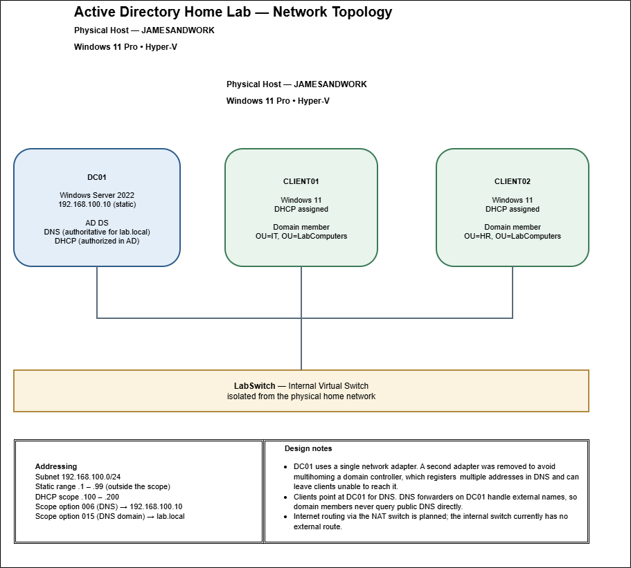

# Active Directory Home Lab

A Windows Server domain built from scratch in Hyper-V to practice and document core system administration work: Active Directory, DNS, DHCP, and PowerShell automation.

Every configuration step in this lab was performed and documented in PowerShell rather than through GUI wizards, so the build is repeatable and the reasoning behind each step is recorded.

---

## Environment

| Role | Hostname | Address | OU |
|---|---|---|---|
| Domain controller | DC01 | 192.168.100.10 (static) | Domain Controllers |
| Windows 11 client | CLIENT01 | DHCP assigned | LabComputers\IT |
| Windows 11 client | CLIENT02 | DHCP assigned | LabComputers\HR |

- **Hypervisor:** Hyper-V on Windows 11 Pro
- **Virtual switch:** Internal, isolated from the physical home network
- **Domain:** lab.local
- **Subnet:** 192.168.100.0/24
- **DHCP scope:** 192.168.100.100 – 192.168.100.200
- **Static range:** 192.168.100.1 – .99 reserved outside the scope



---

## What Is Built

**Active Directory Domain Services**
Forest and domain promoted on DC01. Integrated DNS installed automatically with the role. All FSMO roles held by DC01.

**DNS**
Authoritative for lab.local. Forwarders configured for external resolution, though these are currently inactive by design — see Notes on Scope below.

**DHCP**
Role installed and authorized in Active Directory. Scope configured with option 006 (DNS server) and option 015 (DNS domain name), so clients receive the correct DNS server automatically and can join the domain without per-machine configuration. Configuration exported to XML as a backup.

**Organizational unit structure**
Users and computers are organized in separate OU branches, each subdivided by department:

```
lab.local
├── OU=LabUsers
│   ├── OU=IT, OU=HR, OU=Finance, OU=Operations
└── OU=LabComputers
    ├── OU=IT, OU=HR, OU=Finance, OU=Operations
```

Objects are placed in OUs rather than the default `CN=Users` and `CN=Computers` containers, because Group Policy Objects cannot be linked to a container. Users and computers are separated because every GPO contains a Computer Configuration and a User Configuration section, applied according to where each object type sits — user settings follow the person to whatever machine they log into, while computer settings stay with the machine regardless of who uses it.

**Domain-joined clients**
Two Windows 11 clients joined to lab.local, receiving addressing and DNS automatically from DHCP, and placed in separate department OUs so that Group Policy scoping can be demonstrated and verified across different targets.

**Bulk user provisioning**
`New-LabUsers.ps1` reads a CSV, generates usernames from first initial plus last name, checks for existing accounts before creating, places each user in the OU matching their department, and forces a password change at first logon. The script is idempotent — re-running it skips existing accounts rather than erroring or creating duplicates. Verified end to end by logging into a client with a provisioned account and confirming the forced password change.

---

## Documentation

| Document | Contents |
|---|---|
| [Domain controller and Active Directory](docs/DC01_Powershell.md) | Command log for the OU structure, bulk provisioning script, and domain joins |
| [DHCP installation and configuration](docs/DHCP_Powershell.md) | Command log for the DHCP role, scope, options, forwarders, and backup |

Each document records the commands actually used, the reasoning behind them, and a troubleshooting section covering problems encountered during the build and how they were diagnosed.

---

## Skills Demonstrated

- Active Directory Domain Services installation, forest promotion, and OU design
- Domain join and client-side configuration verification
- DNS zone hosting, record registration, and conditional forwarding
- DHCP scope configuration, AD authorization, scope options, and lease verification
- PowerShell scripting: CSV input, loops, conditional logic, error handling, idempotent operations
- Hyper-V virtual machine, virtual switch, and checkpoint management
- Static and dynamic IP addressing, subnetting, and client-side network troubleshooting
- Documenting infrastructure work in a form another administrator could follow

---

## In Progress

- Security groups and automated group membership during provisioning
- Group Policy Objects linked to user and computer OUs
- Windows Defender Firewall policy managed centrally through Group Policy
- Automated offboarding script (disable account, remove group memberships, move to a disabled OU)
- Internet routing for lab clients via NAT switch

---

## Notes on Scope

This is a lab environment and some configurations are deliberately simplified.

The domain controller was initially given a second network adapter to provide internet access. This was removed after recognizing that a multihomed domain controller registers multiple addresses in DNS, which can cause clients to attempt connections on an unreachable address. The lab now runs on a single isolated adapter, and external routing is planned through a NAT switch instead. As a result, the configured DNS forwarders currently have no route to their upstream resolvers — internal resolution for lab.local is unaffected.

The provisioning script uses a hardcoded default password rather than a credential store. DHCP dynamic DNS registration runs under the domain controller machine account rather than a dedicated service account, which the DHCP documentation records as a least-privilege finding. The DHCP scope omits a default gateway because the internal virtual switch provides no route off the subnet. Each of these is noted in the relevant document alongside what the production approach would be.

---

## About

Built and maintained by James Andrew Kearse — U.S. Marine Corps veteran and IT support professional.
CompTIA A+ and Network+ certified. B.S. in Information Technology.
