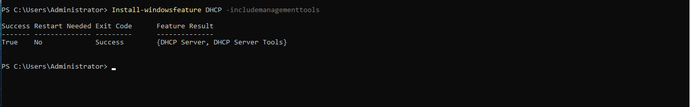

# Active Directory Home Lab

A virtualized Windows Server Active Directory environment I built to practice and demonstrate core system administration and IT support skills — account provisioning, group policy, DNS/DHCP, and onboarding/offboarding workflows.

---

## Overview

I built this home lab to keep my hands-on Active Directory and Windows administration skills current and to practice the day-to-day tasks common to IT support and systems administration roles. The lab simulates a small business environment with a domain controller and domain-joined client workstations, and I use it to practice real account, group, and policy management workflows.

---

## Skills Demonstrated

- Active Directory Domain Services (AD DS) installation and configuration
- User account provisioning and lifecycle management
- Security group and Organizational Unit (OU) design
- Group Policy Object (GPO) creation and management
- DNS and DHCP configuration
- Domain-joining and managing Windows client workstations
- Onboarding and offboarding workflows
- PowerShell automation of routine administrative tasks

---

## Lab Architecture

<!-- Add your network diagram image here once created (e.g., made in draw.io). Example: -->

*A domain controller (DC01) providing AD DS, DNS, and DHCP, with Windows 10/11 clients joined to the lab.local domain over an internal virtual network.*

---

## Environment

| Component | Details |
|-----------|---------|
| Hypervisor | 
| Domain Controller | Windows Server 2022, static IP 192.168.100.5 |
| Client(s) | Windows 10 / Windows 11, domain-joined |
| Domain | lab.local |
| Services | Active Directory Domain Services, DNS, DHCP |

---

## What I Built

- Installed and configured **Windows Server 2022** as a domain controller
- Created a new AD forest and domain (`lab.local`)
- Configured **DNS** (installed automatically with AD DS) and verified name resolution
- Installed and configured a **DHCP** scope for automatic client addressing
- Built an **Organizational Unit** structure mirroring a company (departments and locations)
- Created **user accounts** and **security groups**, and assigned group memberships
- Configured **Group Policy Objects** for password policies, drive mappings, and desktop settings
- Joined **Windows 10/11 clients** to the domain and verified login with domain accounts

---

## Tasks Practiced

**Account Management**
- Creating, disabling, and removing user accounts
- Password resets and account unlocks
- Bulk user creation via PowerShell and CSV import

**Groups & Structure**
- Creating and managing security groups and distribution groups
- Designing and organizing OUs by department and function
- Moving users and computers between OUs

**Group Policy**
- Creating and linking GPOs
- Enforcing password complexity, mapped drives, and login banners
- Scoping policies to specific OUs

**Onboarding / Offboarding Workflows**
- New-hire process: create account → assign groups → place in correct OU → configure settings
- Offboarding process: disable account → remove group memberships → move to Disabled Users OU → document

---

## Automation

Routine AD tasks in this lab are automated with PowerShell. See my related repository:
<!-- link your PowerShell toolkit repo here -->
[IT Support PowerShell Toolkit](https://github.com/YOUR-USERNAME/it-support-toolkit)

Examples include bulk user creation from CSV, automated onboarding, and offboarding scripts.

---

## Screenshots

<!-- Add screenshots of YOUR real work. Suggested shots: -->
<!-- Active Directory Users and Computers showing your OU structure -->
<!-- A created user account's properties -->
<!-- A Group Policy Object you configured -->
<!-- A client successfully joined to the domain -->
*Add AD forest to server. 

*DHCP Installation via Powershell in AD. 

*Active Directory Users and Computers — OU structure and accounts:*

*Group Policy Management — configured GPO:*

*Windows client joined to the lab.local domain:*

---

## About

Built and maintained by James Andrew Kearse — U.S. Marine Corps veteran and IT support professional.
CompTIA A+ and Network+ certified. B.S. in Information Technology.

