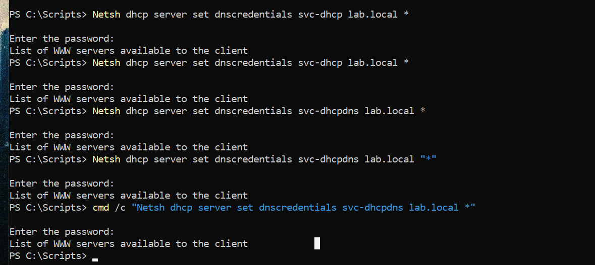
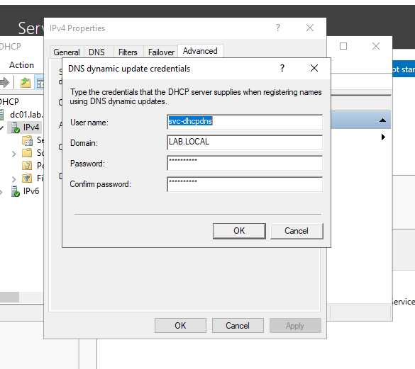

## DHCP Installation and Configuration

*To install DHCP onto the server via PowerShell I used the command below.*
```powershell
  Install-WindowsFeature DHCP -IncludeManagementTools
```

*Next I authorized the DHCP server in Active Directory. A DHCP server will not lease addresses on a domain network until it has been authorized, which prevents rogue DHCP servers from serving clients.*
```powershell
  Add-DhcpServerInDC -DnsName "DC01.lab.local" -IPAddress 192.168.100.10
```

*Next, add a DHCP range. Addresses .1 through .99 are left outside the scope so that statically assigned machines never collide with the pool.*
```powershell
  Add-DhcpServerv4Scope -Name "LabScope" -StartRange 192.168.100.100 -EndRange 192.168.100.200 -SubnetMask 255.255.255.0 -State Active
```

*Set the DNS options so clients automatically learn to use DC01 for DNS. This is what allows a client to join the domain without any per-machine configuration.*
```powershell
  Set-DhcpServerv4OptionValue -ScopeId 192.168.100.0 -DnsServer 192.168.100.10 -DnsDomain "lab.local"
```

*Clear post-install flags and restart the service.*
```powershell
  Set-ItemProperty -Path "HKLM:\SOFTWARE\Microsoft\ServerManager\Roles\12" -Name ConfigurationState -Value 2
  Restart-Service DHCPServer
```

*Verify the scope is active and the server is authorized.*
```powershell
  Get-DhcpServerv4Scope
  Get-DhcpServerInDC
```

*Remove the static IP address and enable DHCP on the client computers.*
```powershell
  Remove-NetIPAddress -InterfaceAlias "Ethernet" -AddressFamily IPv4 -Confirm:$false
  Set-NetIPInterface -InterfaceAlias "Ethernet" -Dhcp Enabled
  Set-DnsClientServerAddress -InterfaceAlias "Ethernet" -ResetServerAddresses
  ipconfig /renew
```

*Verify from the client that it received a lease with the correct DNS server assigned.*
```powershell
  ipconfig /all
```

*Verify from the server that the lease was issued, showing hostname, MAC address, assigned IP, and expiry.*
```powershell
  Get-DhcpServerv4Lease -ScopeId 192.168.100.0
```

*Create DNS forwarding functionality so the domain controller can resolve external names on behalf of clients. Domain members continue to point at the DC for DNS; the DC forwards anything it is not authoritative for.*
```powershell
  Add-DnsServerForwarder -IPAddress 8.8.8.8, 1.1.1.1
  Get-DnsServerForwarder
```

*Note: with the second network adapter removed from DC01 (see troubleshooting below), the server currently has no route to these upstream resolvers. Internal resolution for lab.local is unaffected. External forwarding will become functional once a NAT switch is configured.*

*Create a DHCP backup.*
```powershell
  Export-DhcpServer -File "C:\Backup\dhcp-config.xml" -Leases -Force
```

*Verify.*
```powershell
  Get-ChildItem C:\Backup
```

---

## Troubleshooting Notes

### Client adapter accumulated multiple IPv4 addresses

*A client showed three IPv4 addresses on a single adapter: 192.168.100.10, .20, and .21. `New-NetIPAddress` adds an address to an interface rather than replacing the existing one, so re-running it during configuration attempts stacked all three. One of them was .10, the address belonging to the domain controller, which would have produced an IP conflict and broken name resolution for that client. Fixed by clearing all IPv4 addresses from the interface and assigning a single correct address.*
```powershell
  Get-NetIPAddress -InterfaceAlias "Ethernet" -AddressFamily IPv4

  Remove-NetIPAddress -InterfaceAlias "Ethernet" -AddressFamily IPv4 -Confirm:$false

  New-NetIPAddress -InterfaceAlias "Ethernet" -IPAddress 192.168.100.20 -PrefixLength 24
  Set-DnsClientServerAddress -InterfaceAlias "Ethernet" -ServerAddresses 192.168.100.10
```

### Multihomed domain controller removed

*DC01 was initially configured with a second network adapter to provide internet access for updates. Server Manager subsequently reported the server with two addresses: 192.168.100.10 and a 169.254.x.x APIPA address from the second adapter. Beyond the APIPA symptom, the underlying issue was that the domain controller was multihomed. A domain controller with adapters on multiple networks registers all of its addresses in DNS, and clients may then attempt to reach it on an address they cannot route to, producing intermittent authentication and Group Policy failures. The second adapter was removed in favor of a single isolated adapter, with external routing planned through a NAT switch instead. DNS records were re-registered and verified afterward.*
```powershell
  Get-NetAdapter
  Get-NetIPAddress -AddressFamily IPv4 | Select-Object InterfaceAlias, IPAddress, PrefixOrigin

  ipconfig /registerdns
  Restart-Service netlogon

  Resolve-DnsName dc01.lab.local
```

### Server Manager reported roles missing after a Windows Update

*Following an update and reboot, the Server Manager dashboard listed only File and Storage Services, with no AD DS, DNS, or DHCP entries. PowerShell confirmed the roles were intact and running; Server Manager had simply not refreshed its cached role inventory after the restart. No repair was needed. The takeaway is to verify against the service and role cmdlets rather than the dashboard, since those also work over remoting when no GUI is available.*
```powershell
  Get-ADDomain
  Get-Service NTDS, DNS, DHCPServer
```

### Export-DhcpServer failed with DirectoryNotFoundException

*The backup export failed because the target folder did not exist. Most PowerShell cmdlets that write files will not create parent directories, by design, so that a mistyped path does not silently produce an unexpected folder. Fixed by creating the directory first.*
```powershell
  New-Item -Path "C:\Backup" -ItemType Directory
  Export-DhcpServer -File "C:\Backup\dhcp-config.xml" -Leases -Force
```

### DHCP Event ID 1056 — dynamic DNS registration credentials

*The System log recorded a recurring warning that the DHCP service was running on a domain controller with no dedicated credentials configured for dynamic DNS registration. In that state, DHCP registers client DNS records using the domain controller's machine account, which carries far more privilege than creating a DNS record requires. Anything able to leverage the DHCP service would inherit that privilege.*

*Remediated by creating a dedicated service account with no group memberships beyond Domain Users, placed in a ServiceAccounts OU to keep service identities separate from user accounts.*

```powershell
  $pw = Read-Host -AsSecureString "Password for svc-dhcpdns"

  New-ADOrganizationalUnit -Name "ServiceAccounts" -Path "DC=lab,DC=local"

  New-ADUser -Name "svc-dhcpdns" -SamAccountName "svc-dhcpdns" -UserPrincipalName "svc-dhcpdns@lab.local" -Description "DHCP dynamic DNS registration - least privilege" -AccountPassword $pw -PasswordNeverExpires $true -Enabled $true -Path "OU=ServiceAccounts,DC=lab,DC=local"
```

*The documented command for assigning the credentials, `netsh dhcp server set dnscredentials`, did not behave as expected on Windows Server 2022. Every variation of the syntax accepted the password prompt and then returned unrelated output belonging to a different netsh context, indicating the verb was not being parsed. Running it through cmd rather than PowerShell produced the same result, ruling out a quoting issue. The credentials were configured through the DHCP console instead — right-click the IPv4 node, Properties, Advanced tab, Credentials — which wrote the configuration successfully.*




*Verified by reading the credentials back, restarting the service to trigger the condition that produces the warning, and confirming no new Event 1056 was logged.*

```powershell
  netsh dhcp server show dnscredentials

  Restart-Service DHCPServer

  Get-WinEvent -LogName System -MaxEvents 20 | Where-Object {$_.Id -eq 1056 -and $_.TimeCreated -gt (Get-Date).AddMinutes(-2)}
```

*`show dnscredentials` returned the account and domain, and the filtered event query returned nothing, confirming the warning no longer fires. Note that Event 1056 is logged when the DHCP service starts rather than on each lease, so a service restart is required to test the fix rather than simply renewing a client lease.*

### Virtual machine connection dropped on restart

*Restarting the server produced a "The session was disconnected" dialog in the Virtual Machine Connection window. This is expected behavior rather than a fault: VMConnect uses an RDP-based session for enhanced session mode, and that session is torn down when the guest restarts. The VM status remained Running throughout. Reconnecting after the guest finished booting restored the session.*

---

## Production Considerations

*DHCP dynamic DNS registration should run under a dedicated service account rather than the domain controller machine account. Scope options in this lab omit a default gateway because the internal virtual switch provides no route off the subnet; a production scope would include option 003. A production environment would also configure DHCP failover between two servers so that address assignment survives the loss of a single host.*
