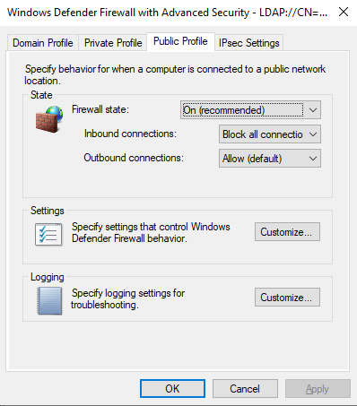
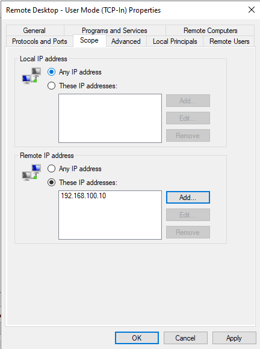
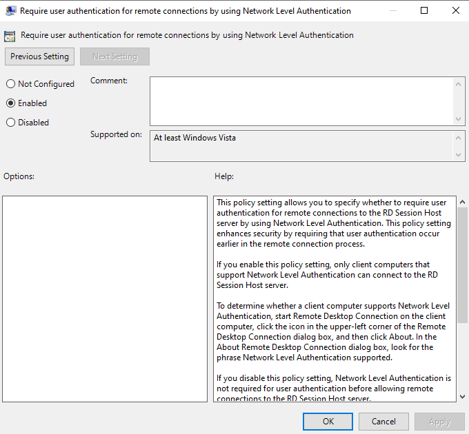
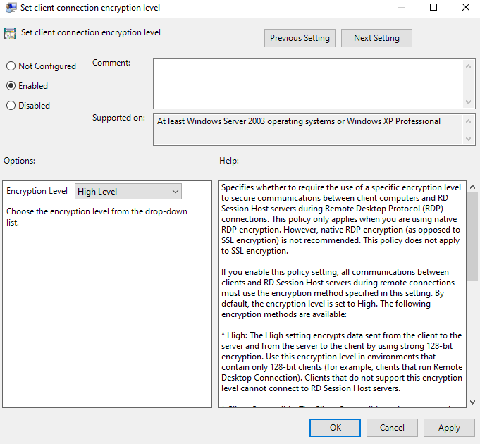
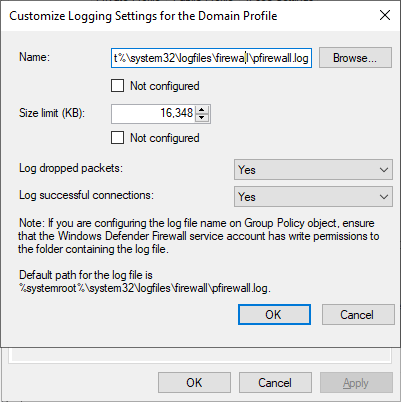
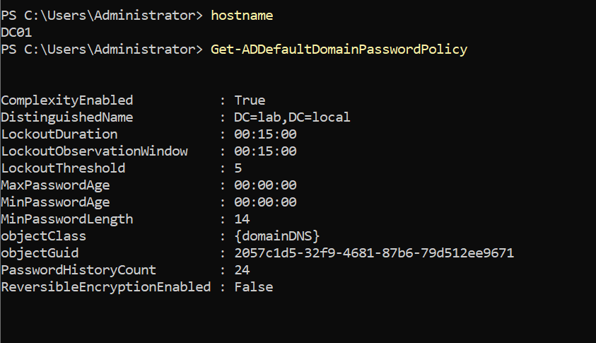
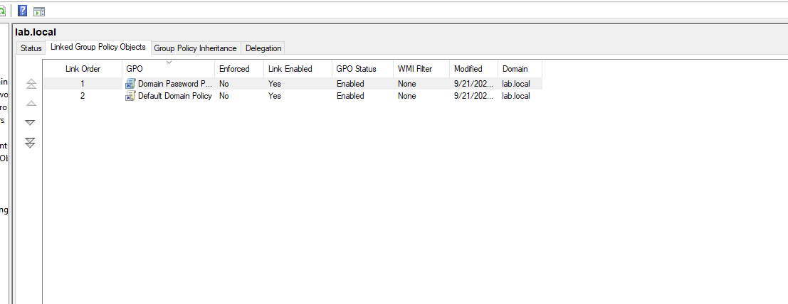
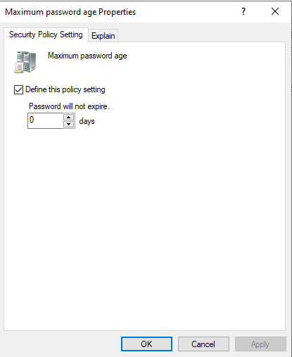
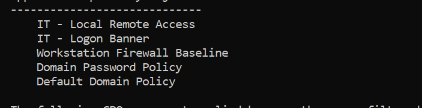
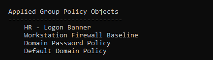

## Group Policy

Group Policy is where this lab moves from "a domain exists" to "the domain is
managed." Two Group Policy Objects are in place: one grants remote-access rights
by group membership, and one applies a Windows Defender Firewall baseline to
every workstation. Both are scoped to computer OUs and verified from the client
side, because a domain controller's own `gpresult` never shows policy targeted at
an OU it does not sit in.

A note on where GPOs are linked: a GPO applies to the objects beneath the OU it
is linked to. Firewall and remote-access settings are Computer Configuration, so
these GPOs link to the `LabComputers` branch, not `LabUsers`.

---

## GPO 1 — IT - Local Remote Access

*Linked to `OU=IT,OU=LabComputers`. Its job is to let members of the
`IT-RemoteAccess` group sign in over RDP to IT workstations, delivered centrally
so no machine is touched by hand.*

Two settings:

- **Local Users and Groups preference** (Computer Configuration → Preferences →
  Control Panel Settings → Local Users and Groups): add `LAB\IT-RemoteAccess` to
  the built-in **Remote Desktop Users** group. Action **Update** (not Replace),
  both "Delete all member users / groups" boxes left unchecked so existing
  membership is preserved, and the **Rename to** field left blank.
- **Administrative template** (Computer Configuration → Policies → Administrative
  Templates → Windows Components → Remote Desktop Services → Remote Desktop
  Session Host → Connections): **Allow users to connect remotely by using Remote
  Desktop Services** = **Enabled**.

*Group membership drives access. Granting a person RDP rights to IT machines is
then a matter of adding them to one group, rather than editing each computer —
the role-based, least-privilege model.*

*Verified from the client, which is the only place OU-targeted policy shows up.*
```powershell
  gpupdate /force
  gpresult /r /scope computer
  # confirm "IT - Local Remote Access" under Applied Group Policy Objects
  net localgroup "Remote Desktop Users"
  # confirm LAB\IT-RemoteAccess is listed
```

---

## GPO 2 — Workstation Firewall Baseline

*Linked to the `OU=LabComputers` parent so it reaches every department. This is
the deny-by-default host firewall baseline, plus the hardening for the one
inbound service the lab exposes: RDP.*

**Profile posture** (Windows Defender Firewall with Advanced Security → Properties):

| Profile | Firewall state | Inbound | Outbound |
|---|---|---|---|
| Domain | On | Block (default) | Allow (default) |
| Private | On | Block (default) | Allow (default) |
| Public | On | **Block all connections** | Allow (default) |

*Domain and Private block inbound by default but honor allow rules — the standard
enterprise posture. Public is deliberately left at "Block all connections"
(shields-up), so an IT workstation taken onto an untrusted network refuses all
inbound regardless of rules. Differentiating trust by profile, rather than one
blanket setting, is the point.*

**Inbound allow rules** (all scoped to the Domain profile):

- Remote Desktop — User Mode (TCP-In) and (UDP-In)
- File and Printer Sharing group (includes ICMPv4 Echo Request and SMB)

**RDP source scoping.** The Remote Desktop rules are restricted on the **Scope**
tab → Remote IP address → `192.168.100.10` (the management/administration host).
RDP is no longer accepted from anywhere on the subnet — only from the management
source. Widening later (an admin jump host, a management subnet) is a matter of
adding addresses to this same list.

**Remote-access hardening** (Remote Desktop Session Host → Security):

- Require user authentication for remote connections by using **Network Level
  Authentication** = Enabled
- Set client connection encryption level = **High Level**

**Session limits** (Remote Desktop Session Host → Session Time Limits): idle
session limit and disconnected session limit both **15 minutes** — the automatic
logoff control.

**Logging** (WDFAS → Properties → each profile → Logging → Customize): log
dropped packets and successful connections, 16 MB, default path
`%systemroot%\system32\logfiles\firewall\pfirewall.log`. Without this, a silent
drop is invisible — see the remediation write-up for what that cost.

*Verified from the client, in the effective (ActiveStore) firewall configuration.*
```powershell
  gpupdate /force
  Get-NetFirewallProfile -PolicyStore ActiveStore |
    Format-Table Name, Enabled, DefaultInboundAction, AllowInboundRules -AutoSize
  # Domain/Private AllowInboundRules True, Public False
```

**Connectivity proof — positive and negative.** The pair together show the
control works *and* restricts:
```powershell
  # From DC01 (192.168.100.10, in scope) — succeeds
  Test-NetConnection 192.168.100.100 -Port 3389   # TcpTestSucceeded : True
  # From CLIENT02 (192.168.100.101, out of scope) — refused, but host still pings
  Test-NetConnection 192.168.100.100 -Port 3389   # PingSucceeded True, TcpTestSucceeded False
```

*The full diagnostic and remediation of the RDP connectivity failure that
surfaced during this work — a shields-up filter overriding the allow rules,
identified by name from a WFP state dump — is documented separately in*
[RDP connectivity remediation & firewall hardening](RDP_Firewall_Remediation.md).

Screenshots:







Additional captures in `screenshots/gpo/`: `firewall-profile-domain.png`, `firewall-profile-private.png`, `rdp-scope-udp.png`, `rdp-session-idle.png`, `rdp-session-disconnected.png`, `firewall-logging-private.png`, `firewall-logging-public.png`. Still to capture: `it-remote-access-gpresult.png` (a `gpresult /r /scope computer` on CLIENT01 showing GPO 1 applied).

---

## GPO 3 — Domain Password Policy

*Linked at the domain root (`lab.local`), not an OU. Account policies (password,
lockout, Kerberos) are domain-wide — a password policy linked to an OU does not
apply to domain user accounts. For per-group or per-OU password rules the tool is
a Fine-Grained Password Policy (PSO), not a GPO. This was created as a dedicated
`Domain Password Policy` GPO and moved to Link Order 1 so it outranks the Default
Domain Policy for these settings.*

**Password Policy** (Computer Configuration → Policies → Windows Settings →
Security Settings → Account Policies → Password Policy):

- Minimum password length — **14**
- Password must meet complexity requirements — **Enabled**
- Enforce password history — **24**
- Maximum password age — **0 (never expires)** — see design notes
- Minimum password age — **0**
- Store passwords using reversible encryption — **Disabled**

**Account Lockout Policy:**

- Account lockout threshold — **5** invalid attempts
- Account lockout duration — **15** minutes
- Reset account lockout counter after — **15** minutes

**Design decisions (NIST SP 800-63B):**

- **No forced expiration (max age 0).** 800-63B states verifiers SHALL NOT require
  periodic rotation — mandatory rotation drives predictable incremental passwords
  (`Summer2024!` → `Summer2025!`) and habituates users to change-on-demand.
  Rotation is triggered only on evidence of compromise. The provisioning script's
  `ChangePasswordAtLogon` on a new account is initial-credential handoff, not
  periodic rotation, so the two are consistent.
- **No maximum password length.** AD has no max-length setting by design; capping
  length is an anti-pattern (800-63B requires permitting ≥64 characters) and blocks
  passphrases. The minimum is the lever; length is encouraged.
- **Complexity kept as a compensating control.** Full 800-63B alignment also drops
  composition rules in favor of breached-password screening, which native AD cannot
  do — that is Entra Password Protection (banned/leaked-credential lists), the
  production upgrade. Complexity stays enabled on-prem in the meantime.
- **Lockout retained, timed not admin-unlock.** NIST prefers graduated
  rate-limiting/backoff, which on-prem AD cannot do; a timed 15-minute lockout is
  the on-prem approximation (Entra Smart Lockout is the intelligent version).
  Admin-required unlock (duration 0) was rejected because it turns the lockout
  policy into a self-inflicted denial-of-service and a help-desk burden.

*Verified on DC01 and from a client:*
```powershell
  Get-ADDefaultDomainPasswordPolicy      # on DC01 — reflects the effective domain policy
  net accounts                            # on a client after gpupdate /force
```





---

## GPO 4 — Department Logon Banners (OU-scoping demonstration)

*Two GPOs demonstrate OU scoping: a computer receives policy only from GPOs linked
along its own OU path. Each also sets a legal logon banner — a real control
mapping to NIST 800-53 AC-8 (System Use Notification) and required by CIS and DoD
STIG baselines — so the demo doubles as a legitimate hardening artifact.*

- **IT - Logon Banner** → linked to `OU=IT,OU=LabComputers`
- **HR - Logon Banner** → linked to `OU=HR,OU=LabComputers`

*Each sets a different title and text under Computer Configuration → Policies →
Windows Settings → Security Settings → Local Policies → Security Options:*

- Interactive logon: Message title for users attempting to log on
- Interactive logon: Message text for users attempting to log on

*Verified — the positive/negative pair across the two clients is the proof of
scoping:*
```powershell
  # CLIENT01 (OU=IT)
  gpresult /r /scope computer     # Applied: IT - Logon Banner; HR - Logon Banner absent

  # CLIENT02 (OU=HR)
  gpresult /r /scope computer     # Applied: HR - Logon Banner; IT - Logon Banner absent
```

*CLIENT01 receives only the IT banner and CLIENT02 only the HR banner, confirming
a computer inherits policy solely from its own OU chain. Both banners are also
visible at the lock screen.*

Screenshots:




Still to capture: `it-banner-lockscreen.png` and `hr-banner-lockscreen.png` — each banner as it appears at the client's lock screen.

---

## Troubleshooting Notes

### GPP "Rename to" field silently renamed the target group

*The Local Users and Groups preference in GPO 1 applied before its configuration
was cleaned up, and the "Rename to" field — which is an action, not a label —
renamed the built-in Remote Desktop Users group to "IT - RemoteAccess" on the
client. Subsequent logons failed with error 1376 ("the specified local group
does not exist"). Diagnosed by well-known SID: the Remote Desktop Users group is
`S-1-5-32-555` regardless of its display name, so the group still existed under a
wrong name. Renamed back on the client with `Rename-LocalGroup`.*
```powershell
  Get-LocalGroup | Where-Object { $_.SID -eq "S-1-5-32-555" }
  Rename-LocalGroup -Name "IT - RemoteAccess" -NewName "Remote Desktop Users"
```

### Group Policy preferences do not self-heal in reverse

*Correcting the GPO did not undo the damage already applied to the client — the
renamed group stayed renamed until fixed directly. A preference pushes a state; it
does not roll back a previous state when the policy changes. The lesson: after
fixing a misapplied preference, remediate the affected clients too, not just the
policy.*

### DC-side gpresult never shows OU-targeted GPOs

*Running `gpresult /r` on DC01 to confirm the firewall baseline showed nothing —
DC01 lives in the Domain Controllers OU, so a GPO linked to `LabComputers` does
not apply to it and does not appear in its resultant set. OU-targeted policy must
be verified on a machine that actually sits in the target OU.*

### gpupdate silently did nothing on a bad switch

*`gpupdate \force` (backslash) is not a valid switch — the tool printed its help
text and never refreshed policy, which looked exactly like "the GPO isn't
applying." Native executables parse their own flags and want forward slashes.
Always confirm "Computer Policy update has completed successfully" rather than
assuming the refresh ran.*

### "Block (default)" vs "Block all connections"

*These read similarly in the firewall profile dropdown but behave very
differently. "Block (default)" blocks inbound that matches no rule but honors
allow rules; "Block all connections" (shields-up) ignores allow rules entirely.
Setting the latter by mistake produces a firewall that drops traffic every allow
rule says to permit — see the remediation write-up.*

### Deleting a GPO's link is not deleting the GPO

*Recreating `IT - Logon Banner` failed with "already exists" after it had
apparently been deleted. Right-clicking a GPO under an OU and choosing Delete
removes only the **link** — the GPO object still lives in the Group Policy Objects
container, and a real delete happens only there (or via `Remove-GPO`). Same shape
as the earlier link-vs-object confusion.*

### Link scope is where the GPO applies

*The HR banner initially appeared on CLIENT01 (an IT-OU machine) because it had
been linked at the domain root, which applies to every computer in the domain.
`gpresult` on CLIENT01 caught it — both banners listed. Moving the link down to
`OU=HR,OU=LabComputers` scoped it correctly. Domain-root link = everyone; OU link
= that OU's objects only. This is the same scoping concept the GPO 4 demo teaches,
experienced as its failure mode first.*

### A gpresult that looks unchanged may be stale

*After moving the link, CLIENT01's `gpresult` still listed the HR banner — but the
"Last time Group Policy was applied" timestamp was unchanged, meaning it was
replaying the previous refresh. `gpresult` reflects the last apply; run
`gpupdate /force` first and confirm the timestamp advanced before trusting the
output.*

---

## Production Considerations

*Remote-access allow rules should be scoped by source address (a management
subnet or jump host), not merely by profile. A flat "RDP allowed on the Domain
profile" is acceptable in a lab; production restricts who may originate the
connection.*

*Domain controllers warrant their own firewall baseline GPO, separate from
workstations and linked to the Domain Controllers OU. Firewall configuration does
not belong in the Default Domain Controllers Policy, which is reserved for the DC
account and security settings.*

*RDP currently trusts a self-signed host certificate (the certificate warning on
first connect). A production environment issues RDP host certificates from an
internal CA (AD Certificate Services) via auto-enrollment, so host identity is
verified automatically and the warning disappears.*

*Multi-factor authentication for administrative and remote access is a
requirement under most frameworks (e.g. PCI DSS) and modern best practice; it is
not achievable with on-premises AD alone and is a candidate for the Entra ID
phase.*

*Privileged accounts warrant a stricter password policy than the domain default —
the mechanism is a Fine-Grained Password Policy (PSO) scoped to an admin group,
since the domain password policy is single and domain-wide.*

---

## Status

All four planned GPOs are implemented and verified:

- **GPO 1** — IT - Local Remote Access
- **GPO 2** — Workstation Firewall Baseline
- **GPO 3** — Domain Password Policy
- **GPO 4** — Department Logon Banners (OU-scoping demonstration)
