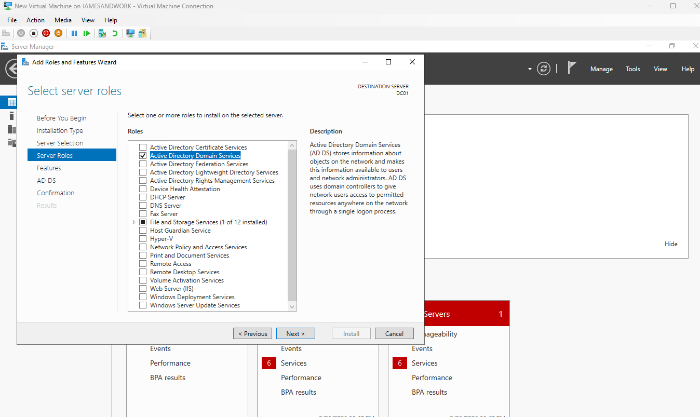
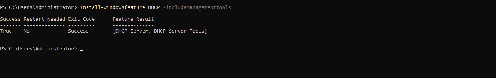

# Lab Rebuild Runbook

A condensed, ordered record of every step required to rebuild this lab from
nothing. The section documents in `docs/` explain the reasoning behind each
decision and record the problems encountered along the way; this file is the
sequence, stripped down to what needs to be run and in what order.

Written both as disaster recovery notes and as a reproducibility check — if the
lab cannot be rebuilt from its own documentation, the documentation is
incomplete.

---

## 1. Host prerequisites

Windows 11 Pro (Home does not include Hyper-V), at least 16 GB RAM, 100 GB free
disk, and hardware virtualization enabled in firmware.

Confirm virtualization is available, then enable Hyper-V and reboot.

```powershell
Get-ComputerInfo -Property "HyperV*"

Enable-WindowsOptionalFeature -Online -FeatureName Microsoft-Hyper-V -All
```

---

## 2. Virtual switch

An internal switch keeps the lab isolated from the physical network. VMs can
reach each other and the host, but nothing routes outward.

```powershell
New-VMSwitch -SwitchName "LabSwitch" -SwitchType Internal
Get-VMSwitch
```

---

## 3. Virtual machines

One domain controller and two clients, all Generation 2, all attached to
LabSwitch. Server ISO and Windows 11 ISO are the free evaluation editions from
the Microsoft Evaluation Center.

```powershell
New-VM -Name "DC01" -Generation 2 -MemoryStartupBytes 4GB `
    -NewVHDPath "C:\VMs\DC01\DC01.vhdx" -NewVHDSizeBytes 60GB `
    -SwitchName "LabSwitch"

New-VM -Name "CLIENT01" -Generation 2 -MemoryStartupBytes 4GB `
    -NewVHDPath "C:\VMs\CLIENT01\CLIENT01.vhdx" -NewVHDSizeBytes 60GB `
    -SwitchName "LabSwitch"

New-VM -Name "CLIENT02" -Generation 2 -MemoryStartupBytes 4GB `
    -NewVHDPath "C:\VMs\CLIENT02\CLIENT02.vhdx" -NewVHDSizeBytes 60GB `
    -SwitchName "LabSwitch"
```

Attach the installation media and confirm the Secure Boot template is set to
Microsoft Windows, then install Windows on each. Choose the Desktop Experience
edition on the server.

```powershell
Add-VMDvdDrive -VMName "DC01" -Path "C:\ISO\WindowsServer2022.iso"
Set-VMFirmware -VMName "DC01" -SecureBootTemplate MicrosoftWindows
```

---

## 4. Domain controller networking

A domain controller requires a fixed address, and it points DNS at itself
because it will host the zone.

Use a single network adapter. A domain controller with adapters on multiple
networks registers all of its addresses in DNS, and clients may then attempt to
reach it on an address they cannot route to.

```powershell
New-NetIPAddress -InterfaceAlias "Ethernet" -IPAddress 192.168.100.10 -PrefixLength 24
Set-DnsClientServerAddress -InterfaceAlias "Ethernet" -ServerAddresses 127.0.0.1
Rename-Computer -NewName "DC01" -Restart
```

---

## 5. Promote to domain controller

Installs AD DS and creates a new forest. DNS is installed and configured
automatically as part of the promotion.

```powershell
Install-WindowsFeature AD-Domain-Services -IncludeManagementTools

Install-ADDSForest -DomainName "lab.local"
```

Supply a Directory Services Restore Mode password when prompted and allow the
reboot. Log back in as `LAB\Administrator`.



Verify the forest and the services that support it.

```powershell
Get-ADDomain
Get-Service NTDS, DNS
```

---

## 6. DNS forwarders

The domain controller is authoritative for `lab.local`. Forwarders send
everything else upstream, so domain members can keep pointing at the DC for all
resolution rather than querying public DNS directly.

```powershell
Add-DnsServerForwarder -IPAddress 8.8.8.8
Add-DnsServerForwarder -IPAddress 1.1.1.1
Get-DnsServerForwarder
```

Note: with an internal-only virtual switch there is no route to these
resolvers. Internal resolution is unaffected. External forwarding becomes
functional once a NAT switch is configured.

---

## 7. DHCP

Install the role, authorize the server in Active Directory, create the scope,
and set the options that let clients find the domain without manual
configuration.

Addresses `.1` through `.99` are deliberately left outside the scope so
statically assigned machines never collide with the pool.

```powershell
Install-WindowsFeature DHCP -IncludeManagementTools

Add-DhcpServerInDC -DnsName "DC01.lab.local" -IPAddress 192.168.100.10

Add-DhcpServerv4Scope -Name "LabScope" `
    -StartRange 192.168.100.100 -EndRange 192.168.100.200 `
    -SubnetMask 255.255.255.0 -State Active

Set-DhcpServerv4OptionValue -ScopeId 192.168.100.0 `
    -DnsServer 192.168.100.10 -DnsDomain "lab.local"

Set-ItemProperty -Path "HKLM:\SOFTWARE\Microsoft\ServerManager\Roles\12" `
    -Name ConfigurationState -Value 2
Restart-Service DHCPServer
```



Create a dedicated least-privilege service account for dynamic DNS registration,
then set it as the DHCP DNS credentials (via the DHCP console → IPv4 →
Properties → Advanced → Credentials — the `netsh` verb for this does not behave
correctly on Server 2022). This remediates Event ID 1056. See
[DHCP documentation](DHCP_Powershell.md) for detail.

```powershell
$pw = Read-Host -AsSecureString "Password for svc-dhcpdns"
New-ADOrganizationalUnit -Name "ServiceAccounts" -Path "DC=lab,DC=local"
New-ADUser -Name "svc-dhcpdns" -SamAccountName "svc-dhcpdns" `
    -UserPrincipalName "svc-dhcpdns@lab.local" `
    -Description "DHCP dynamic DNS registration - least privilege" `
    -AccountPassword $pw -PasswordNeverExpires $true -Enabled $true `
    -Path "OU=ServiceAccounts,DC=lab,DC=local"
```

Verify the scope is active and the server is authorized, then back up the config.
The target directory must exist first; most cmdlets that write files will not
create parent directories.

```powershell
Get-DhcpServerv4Scope
Get-DhcpServerInDC

New-Item -Path "C:\Backup" -ItemType Directory
Export-DhcpServer -File "C:\Backup\dhcp-config.xml" -Leases -Force
```

---

## 8. Organizational unit structure

Users and computers live in separate branches, each subdivided by department.
Objects are moved out of the default `CN=Users` and `CN=Computers` containers
because a container cannot have a Group Policy Object linked to it.

The two branches are separated because every GPO contains both a User
Configuration and a Computer Configuration section. User settings follow the
person to whatever machine they log into; computer settings stay with the
machine regardless of who uses it.

```powershell
New-ADOrganizationalUnit -Name "LabUsers" -Path "DC=lab,DC=local"
New-ADOrganizationalUnit -Name "IT" -Path "OU=LabUsers,DC=lab,DC=local"
New-ADOrganizationalUnit -Name "HR" -Path "OU=LabUsers,DC=lab,DC=local"
New-ADOrganizationalUnit -Name "Finance" -Path "OU=LabUsers,DC=lab,DC=local"
New-ADOrganizationalUnit -Name "Operations" -Path "OU=LabUsers,DC=lab,DC=local"

New-ADOrganizationalUnit -Name "LabComputers" -Path "DC=lab,DC=local"
New-ADOrganizationalUnit -Name "IT" -Path "OU=LabComputers,DC=lab,DC=local"
New-ADOrganizationalUnit -Name "HR" -Path "OU=LabComputers,DC=lab,DC=local"
New-ADOrganizationalUnit -Name "Finance" -Path "OU=LabComputers,DC=lab,DC=local"
New-ADOrganizationalUnit -Name "Operations" -Path "OU=LabComputers,DC=lab,DC=local"
```

Verify. Distinguished names confirm the nesting; the Name column alone is
ambiguous, since both branches contain OUs with identical names.

```powershell
Get-ADOrganizationalUnit -Filter * | Select-Object Name, DistinguishedName
```

---

## 9. Security groups

Access is granted by group membership, not per-user rights. Create a department
security group in each user OU, plus the cross-cutting `IT-RemoteAccess` group
used to grant RDP. These must exist before user provisioning, because the
provisioning script adds each user to their `<Department>-Users` group.

```powershell
New-ADGroup -Name "IT-Users"         -GroupScope Global -GroupCategory Security -Path "OU=IT,OU=LabUsers,DC=lab,DC=local"
New-ADGroup -Name "HR-Users"         -GroupScope Global -GroupCategory Security -Path "OU=HR,OU=LabUsers,DC=lab,DC=local"
New-ADGroup -Name "Finance-Users"    -GroupScope Global -GroupCategory Security -Path "OU=Finance,OU=LabUsers,DC=lab,DC=local"
New-ADGroup -Name "Operations-Users" -GroupScope Global -GroupCategory Security -Path "OU=Operations,OU=LabUsers,DC=lab,DC=local"

New-ADGroup -Name "IT-RemoteAccess"  -GroupScope Global -GroupCategory Security -Path "OU=LabUsers,DC=lab,DC=local"
Add-ADGroupMember -Identity "IT-RemoteAccess" -Members jsmith, sjohnson
```

---

## 10. User provisioning

Department OUs and the department groups must exist before this runs. Place
`New-LabUsers.ps1` and `newusers.csv` from the `scripts/` folder into `C:\Scripts`.

```powershell
Set-ExecutionPolicy RemoteSigned

cd C:\Scripts
.\New-LabUsers.ps1
```

The script creates each user in the correct OU, forces a password change at first
logon, and adds each to their department group. Verify placement and membership,
then re-run to confirm it is idempotent — accounts are skipped and group
memberships re-verified rather than duplicated.

```powershell
Get-ADUser -Filter * | Select-Object Name, DistinguishedName
.\Test-LabGroupMembership.ps1 | Where-Object MissingFromGroup

.\New-LabUsers.ps1
```

---

## 11. Client configuration and domain join

Run on each client. Clear any static configuration, switch to DHCP, and let the
scope supply both the address and the DNS server.

```powershell
Remove-NetIPAddress -InterfaceAlias "Ethernet" -AddressFamily IPv4 -Confirm:$false
Set-NetIPInterface -InterfaceAlias "Ethernet" -Dhcp Enabled
Set-DnsClientServerAddress -InterfaceAlias "Ethernet" -ResetServerAddresses
ipconfig /renew
```

Verify before joining. Port 389 is tested rather than ICMP because it confirms
the directory service itself is answering, not merely that the host is up.

```powershell
ipconfig /all
Test-NetConnection 192.168.100.10 -Port 389
Resolve-DnsName lab.local
```

Join, renaming in the same operation if the machine still carries a default
hostname. Note that the cmdlet aborts entirely if the new name matches the
current one, so omit `-NewName` on an already-renamed machine.

```powershell
Add-Computer -DomainName "lab.local" -NewName "CLIENT01" -Restart
```

---

## 12. Computer object placement

Computer objects land in `CN=Computers` on join and must be moved into an OU
before computer-side Group Policy can target them. The two clients are placed in
different department OUs so that policy scoping can be verified across separate
targets.

Run on the domain controller — the ActiveDirectory module installs with the
AD DS role and does not exist on member workstations.

```powershell
Get-ADComputer CLIENT01 | Move-ADObject -TargetPath "OU=IT,OU=LabComputers,DC=lab,DC=local"
Get-ADComputer CLIENT02 | Move-ADObject -TargetPath "OU=HR,OU=LabComputers,DC=lab,DC=local"

Get-ADComputer -Filter * | Select-Object Name, DistinguishedName
```

DC01 stays in the built-in Domain Controllers OU, where the Default Domain
Controllers Policy is linked. Do not move it.

---

## 13. Computer object pre-staging

Pre-stage placeholder computer objects per department so Group Policy targeting
and OU-scoped reporting have realistic targets without a VM per object. Run from
the `scripts/` folder.

```powershell
.\New-LabComputers.ps1

# placeholders have no DNSHostName; real machines do
Get-ADComputer -Filter * -Properties DNSHostName | Select-Object Name, DNSHostName
```

---

## 14. Group Policy

Two GPOs. Full settings, verification, and troubleshooting are in
[Group Policy](GroupPolicy.md); the sequence is:

1. **IT - Local Remote Access** — link to `OU=IT,OU=LabComputers`. Local Users and
   Groups preference adds `LAB\IT-RemoteAccess` to the built-in Remote Desktop
   Users group; Admin Template enables RDP.
2. **Workstation Firewall Baseline** — link to `OU=LabComputers`. Firewall on all
   profiles; Domain/Private inbound Block (default), Public Block all connections;
   RDP allow rules scoped to the management source (`192.168.100.10`); NLA
   required, High encryption; idle/disconnected session limits; firewall logging.

Then refresh and verify from a client (OU-targeted policy does not appear in a
DC's own `gpresult`):

```powershell
gpupdate /force
gpresult /r /scope computer
Get-NetFirewallProfile -PolicyStore ActiveStore | Format-Table Name, Enabled, DefaultInboundAction, AllowInboundRules -AutoSize
```

---

## 15. End-to-end verification

Log into a domain-joined client with one of the provisioned accounts. A forced
password change on first logon confirms that the account, its OU placement, and
the password policy all took effect.

Confirm the full picture from the domain controller, and confirm scoped RDP from
an in-scope source.

```powershell
Get-ADDomain
Get-Service NTDS, DNS, DHCPServer
Get-DhcpServerv4Scope
Get-DhcpServerv4Lease -ScopeId 192.168.100.0
Get-ADUser -Filter * | Select-Object Name, DistinguishedName
Get-ADComputer -Filter * | Select-Object Name, DistinguishedName
Resolve-DnsName dc01.lab.local

# scoped RDP reachable from the management host (192.168.100.10)
Test-NetConnection 192.168.100.100 -Port 3389
```

---

## 16. Checkpoints

Take a checkpoint of each VM in a known-good state before making any
significant change. Run from the host — Hyper-V cmdlets do not exist inside a
guest, which has no awareness that it is virtualized.

```powershell
Checkpoint-VM -Name "DC01" -SnapshotName "Clean build"
Checkpoint-VM -Name "CLIENT01" -SnapshotName "Clean build"
Checkpoint-VM -Name "CLIENT02" -SnapshotName "Clean build"

Get-VMSnapshot -VMName "DC01"
```

---

## Known gaps

Recorded so that a rebuild does not silently inherit them:

- The provisioning script contains a hardcoded default password.
- No route to the internet from the lab subnet; a NAT switch is planned.
- The DHCP scope omits a default gateway, since the internal switch provides no
  route off the subnet.
- Administration is performed by logging into the domain controller directly.
  Production practice is to manage the domain from a workstation using the Remote
  Server Administration Tools, since interactive logon to a DC exposes privileged
  credentials on a system that should have minimal exposure.
- RDP host identity relies on a self-signed certificate; an internal CA
  (AD Certificate Services) is the planned production fix.
- Domain controller firewall logging was set locally; it is slated to move to a
  dedicated Domain Controller firewall baseline GPO.

*Resolved since earlier drafts: DHCP dynamic DNS registration now runs under the
dedicated `svc-dhcpdns` account (Event 1056 remediated), and the RDP/firewall
one-way reachability failure is fixed and documented in
[RDP remediation](RDP_Firewall_Remediation.md).*
