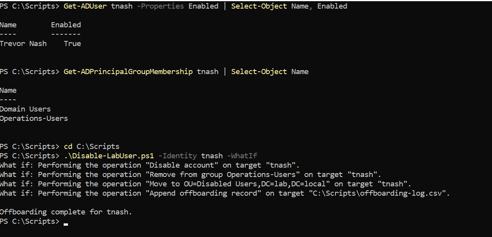
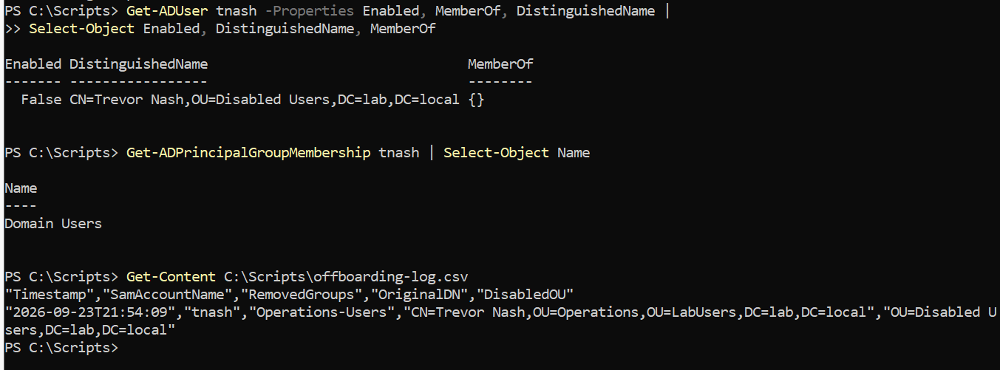

# User Offboarding (Deprovisioning)

Automated, logged, repeatable offboarding of a departing user — the technical
half of a joiner-mover-leaver process. Access revocation on separation is a
control auditors test directly (SOC 2 Common Criteria CC6, NIST 800-53 AC-2, CIS
Control 6), and doing it by script makes the steps consistent and the outcome
evidenced rather than relying on an admin to remember each one.

## The Disabled Users OU

Disabled accounts are moved into a dedicated `Disabled Users` OU, out of the
department OUs. This segregates them for review and retention handling, and
removes them from department-scoped Group Policy so a dormant account inherits
nothing.

```powershell
New-ADOrganizationalUnit -Name "Disabled Users" -Path "DC=lab,DC=local"
```

## The script

[`scripts/Disable-LabUser.ps1`](../scripts/Disable-LabUser.ps1) performs four
steps as a single operation, and supports `-WhatIf` so the full set of changes
can be previewed before anything is modified:

1. **Disable the account** (`Disable-ADAccount`) so it can no longer authenticate.
2. **Strip group memberships** — all groups except the primary group, Domain
   Users, which cannot be removed with `Remove-ADGroupMember`.
3. **Move to the Disabled Users OU**, out of the department OU.
4. **Append a timestamped CSV record** (user, removed groups, original DN) for an
   auditable trail.

## Verification

Tested end to end on `tnash` (Trevor Nash, Operations). Dry run first, then
execute, then confirm.

*Dry run — shows every action, changes nothing:*
```powershell
.\Disable-LabUser.ps1 -Identity tnash -WhatIf
```



*Execute, then verify state:*
```powershell
.\Disable-LabUser.ps1 -Identity tnash

Get-ADUser tnash -Properties Enabled, MemberOf, DistinguishedName |
  Select-Object Enabled, DistinguishedName, MemberOf
Get-ADPrincipalGroupMembership tnash | Select-Object Name
Get-Content C:\Scripts\offboarding-log.csv
```




Confirmed results:

- `Enabled` = **False**
- DistinguishedName = **`CN=Trevor Nash,OU=Disabled Users,DC=lab,DC=local`**
- Group membership reduced to **Domain Users** only (Operations-Users removed)
- Log row captured: timestamp, `tnash`, `RemovedGroups = Operations-Users`, and
  the original DN (`OU=Operations,OU=LabUsers,...`)

## Compliance mapping

| Control | Framework |
|---|---|
| Timely revocation of access on separation | SOC 2 CC6.1–6.3 · NIST 800-53 AC-2 · CIS Control 6 |
| Auditable record of the deprovisioning action | SOC 2 CC7.2 (evidence) · AU-family (audit) |
| Least privilege preserved (group removal, not just disable) | SOC 2 CC6.1 · NIST AC-6 |

The disable-don't-delete approach preserves the audit trail and allows data
recovery; a retention window followed by deletion is the usual production
lifecycle.

## Production considerations

- In production this is typically **triggered automatically** by the HR/identity
  system (e.g. Entra ID lifecycle workflows / joiner-mover-leaver), not run by
  hand. This script is the manual/scriptable equivalent of that control.
- A complete offboarding also **revokes active sessions and tokens**, resets the
  password, handles the mailbox (hide from GAL / convert to shared), reassigns
  data ownership, and removes privileged role assignments first.
- The action **log should land in a central, tamper-resistant store** (a SIEM or
  append-only log service), not a local CSV, so the evidence survives the host.
