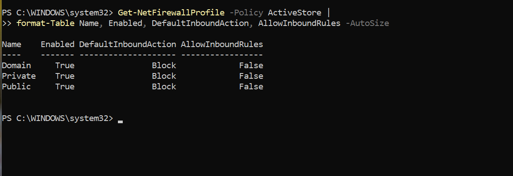
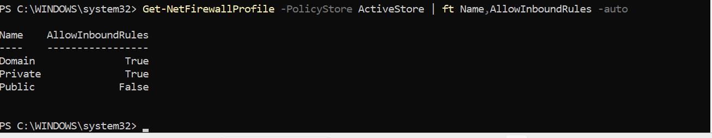
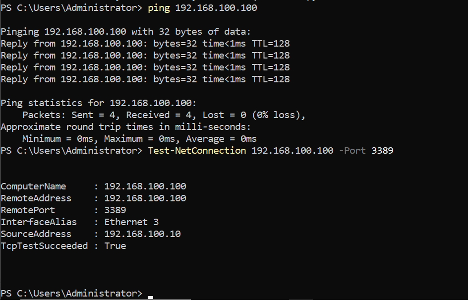
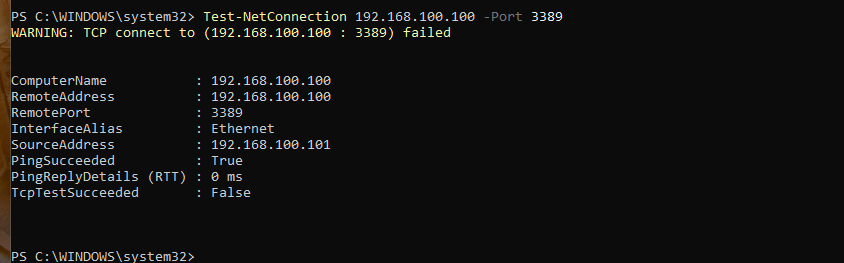
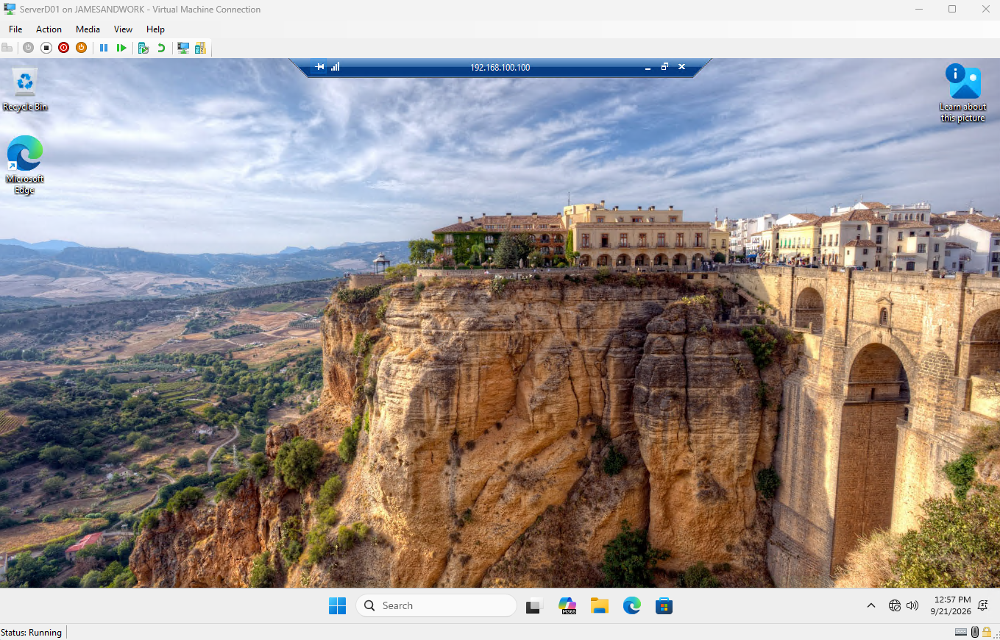
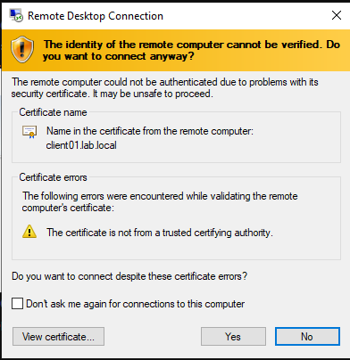

# RDP Connectivity Remediation & Workstation Firewall Hardening

> Resolution of a persistent one-way RDP/ICMP reachability failure between DC01 and
> CLIENT01, and the hardening + compliance baseline built on top of the fix.
> Spans lab Sessions 3–5.

## Overview

The goal was straightforward: allow `LAB\jsmith` (a member of `IT-RemoteAccess`) to
RDP into **CLIENT01** (`192.168.100.100`). The symptom was not: **DC01 → CLIENT01
failed on both ICMP and TCP 3389, while CLIENT01 → DC01 succeeded** — persistent,
one-way unreachability that survived reboots, NIC rebuilds, stack resets, and a full
host cold boot.

Every host-based firewall *allow* rule was verified correct (Remote Desktop TCP-In/UDP-In
and ICMP echo, all `Enabled`, `Allow`, `Domain` profile), yet inbound traffic still died.
The contradiction — correct allow rules, traffic still dropped — was the whole puzzle, and
the answer turned out to be the plainest thing on the board once the evidence was read
directly instead of inferred.

## Environment

See the main lab topology doc for full detail. Relevant machines:

| Role | VM | IP | Notes |
|---|---|---|---|
| DC01 | `ServerD01` | `192.168.100.10` (static) | AD DS / DNS / DHCP, all FSMO. Domain Controllers OU. |
| CLIENT01 | `winpro_lab1` | `192.168.100.100` (DHCP) | `OU=IT,OU=LabComputers`. The remediation target. |
| CLIENT02 | `winpro_lab2` | `192.168.100.101` (DHCP) | `OU=HR,OU=LabComputers`. Used as the out-of-scope control. |

Internal-only Hyper-V switch (`lab.local.switch`), subnet `192.168.100.0/24`.

## Diagnostic methodology

The value of this incident is the method, not just the fix. Reachability was eliminated
layer by layer — client firewall → IP config → virtual switch → L2/ARP → DC firewall →
DC adapter/route/stack — with each layer ruled out by direct test. That process is
documented in full in the session handoffs; two turning points matter here.

**1. `pktmon` ended the guessing.** A packet capture on CLIENT01 during a ping from DC01
showed the echo requests arriving intact and traversing the entire NDIS stack — miniport,
capture filters, WFP MAC layer, TCPIP binding — then dying at `tcpip.sys` (TCP/IPv4 L3/L4)
with `DropReason: inspection drop`, **in both directions**. "Inspection drop" means the
Windows Filtering Platform (WFP) rejected the packet. The network path was healthy end to
end; CLIENT01's own filtering engine was refusing the traffic at the last step.

**2. The WFP state dump (`wfpdiag`) named the filter.** Parsing the capture's 59 drop
events isolated four filters responsible for every drop involving DC01, and — critically —
every one carried the provider **`FWPM_PROVIDER_MPSSVC_WF`**: the built-in Windows Defender
Firewall service. Not a third-party callout driver, not a stale orphaned filter, not an
IPsec connection-security rule.

| filterId | Name | Layer | Action | What it dropped |
|---|---|---|---|---|
| **69316** | **Shielded Main Rule** | `ALE_AUTH_RECV_ACCEPT_V4` | **BLOCK, no conditions** | inbound ICMP echo from DC01 |
| 69318 | Shielded Main Rule (sibling) | `ALE_AUTH_RECV_ACCEPT` | BLOCK, no conditions | inbound |
| 70028 | Port Scanning Prevention Filter | `INBOUND_TRANSPORT_V4_DISCARD` | callout → silent drop (stealth) | inbound return traffic |
| 70030 | Port Scanning Prevention Filter | `OUTBOUND_ICMP_ERROR_V4` | BLOCK (stealth) | outbound ICMP errors to DC01 |

## Root cause

**Filter 69316, "Shielded Main Rule"** — an *unconditional* `FWP_ACTION_BLOCK` at the
inbound-accept layer, sitting at high weight in the MpsSvc sublayer, **above** the allow
rules. That is the exact construct Windows installs when a firewall profile has
**"Block all incoming connections, including those in the list of allowed apps"** enabled —
i.e. **shields-up / shielded mode**.

This resolved the central paradox: **shielded mode bypasses allow rules entirely.** An
unconditional block at the accept layer wins before the RDP or ICMP allow rules are ever
consulted. The two "Port Scanning Prevention" (stealth) filters explain the *shape* of the
failure — they silently drop and suppress the outbound ICMP unreachable/RST, which is why
DC01 only ever saw uniform `TimedOut` with nothing coming back.

Confirmed at the profile level — all three profiles showed `AllowInboundRules = False`
(the shields-up signature) while remaining enabled with a default-block posture. The
setting was being asserted by Group Policy (it reappeared after every local override on
`gpupdate`), which is why local "disable the firewall" tests during earlier sessions had
appeared to fail: policy simply re-enabled it.

## Remediation

All changes were made **in Group Policy**, not on the client, so the configuration has a
single enforced source of truth (a local override would be config drift — the very thing
that masked this bug for three sessions). Sequence:

**1. Snapshot first** (change-management evidence)
```powershell
# HOST: checkpoint each VM labeled pre-firewall-remediation
# CLIENT01: capture before-state
Get-NetFirewallProfile -PolicyStore ActiveStore |
  Select Name,Enabled,DefaultInboundAction,AllowInboundRules |
  Export-Csv C:\Backup\fw-before.csv -NoTypeInformation
```

**2. Un-shield at the GPO** — *Workstation Firewall Baseline* → WDFAS → Properties:
- **Domain** and **Private** profiles → Inbound connections → **Block (default)**
- **Public** profile → left at **Block all connections** (deliberate lockdown for untrusted networks)

**3. Scope RDP to the management source** — the Remote Desktop (TCP-In) and (UDP-In)
inbound rules → Scope tab → Remote IP address → `192.168.100.10` (DC01 only; widen to the
static `192.168.100.1–99` range if additional admin hosts are added later).

**4. Harden the remote-access path** — *IT - Local Remote Access* GPO → RDS Session Host:
- Security → "Require user authentication … using NLA" = **Enabled**; "Set client connection encryption level" = **High Level**
- Session Time Limits → idle = **15 min**, disconnected = **15 min**

**5. Enable firewall logging** (all three profiles) — log dropped packets + successful
connections, 16 MB, default `%systemroot%\system32\logfiles\firewall\pfirewall.log`.

**6. Push and verify**
```powershell
# CLIENT01 and CLIENT02  (note: /force uses a forward slash)
gpupdate /force
```

## Verification

```powershell
# CLIENT01 — shields-up cleared on managed profiles
Get-NetFirewallProfile -PolicyStore ActiveStore | ft Name,AllowInboundRules -Auto
```
| Profile | AllowInboundRules | Result |
|---|---|---|
| Domain | True | ✅ allow rules active |
| Private | True | ✅ allow rules active |
| Public | False | ✅ intentional lockdown retained |

**Positive and negative connectivity tests** — the pair together prove the control both
*works* and *restricts*:

```powershell
# FROM DC01 (192.168.100.10 — in RDP scope)
Test-NetConnection 192.168.100.100 -Port 3389
#   SourceAddress   : 192.168.100.10
#   TcpTestSucceeded : True         <- RDP reachable

# FROM CLIENT02 (192.168.100.101 — out of RDP scope)
Test-NetConnection 192.168.100.100 -Port 3389
#   SourceAddress   : 192.168.100.101
#   PingSucceeded    : True          <- host still reachable (ICMP allowed)
#   TcpTestSucceeded : False         <- RDP correctly refused by scope
```

The CLIENT02 result is the key evidence: **ping succeeds but 3389 is refused**, confirming
the scoping is surgical — RDP is restricted to the management source without severing
general connectivity.

Final end-to-end confirmation: `mstsc` → `192.168.100.100`, authenticated as `LAB\jsmith`.

Evidence (screenshots):








The root-cause finding itself came from the text `wfpdiag` dump rather than a GUI, so there is no screenshot of the "Shielded Main Rule" filter; the drop analysis above is the record of it.

## Compliance control mapping

Every change maps to a recognized security control. Ordered commercial-first (the
frameworks a non-defense enterprise cares about); the regulated frameworks are shown as
a secondary "also maps to" column.

| Control implemented | Verification | CIS v8 / NIST CSF 2.0 / SOC 2 | Also maps to |
|---|---|---|---|
| Deny-by-default inbound, allow by exception | `DefaultInboundAction = Block`, allow rules enabled | CIS 4.4/13 · CSF PR.PS · SOC 2 CC6.6 | NIST 800-171 3.13.6 · PCI Req 1 |
| RDP scoped to management source | positive/negative `Test-NetConnection` | CIS 12 · CSF PR.AA · SOC 2 CC6.1 | 800-171 3.1.14 · PCI Req 7 |
| Least-privilege remote access (`IT-RemoteAccess`) | `gpresult`, RDP restricted to IT | CIS 6 · CSF PR.AA · SOC 2 CC6.1–6.3 | 800-171 3.1.1/3.1.5 · HIPAA §164.308(a)(4) |
| NLA required + High encryption | `UserAuthentication = 1` | CIS 3/6 · CSF PR.DS · SOC 2 CC6.7 | 800-171 3.1.13 · HIPAA §164.312(e) |
| Firewall logging (drop + allow) | `pfirewall.log` populating | CIS 8 · CSF DE.CM · SOC 2 CC7.2 | 800-171 3.3.1 · PCI Req 10 |
| Idle / disconnected session limits | GPO applied | CIS 4 · CSF PR.AA · SOC 2 CC6.1 | HIPAA §164.312(a)(2)(iii) |
| GPO-enforced baseline (single source of truth) | change made in GPO, verified via `gpupdate` | CIS 4 · CSF PR.PS · SOC 2 CC8.1 | 800-171 3.4.1/3.4.2 |

> **Scope note:** this lab *implements and verifies the technical controls* underlying the
> frameworks above. Full compliance additionally requires organizational scope, written
> policy, risk assessment, and retained evidence over time (SOC 2 Type II).

## Plan of Action & Milestones (open items)

| Item | Rationale | Priority |
|---|---|---|
| Domain Controller Firewall Baseline GPO (linked to Domain Controllers OU) | DC01's firewall is currently ungoverned by policy; DC logging was set locally (drift). DCs warrant their own hardened baseline, separate from workstations. Migrate the local DC logging change here, then clear the local setting. | High |
| MFA on administrative / remote access | PCI Req 8.4/8.5 and modern best practice require MFA for admin/remote access; not achievable on-prem without additional tooling (candidate for the Entra phase). | Medium |
| Explicit "Block" on DefaultInboundAction | Cosmetic — makes verification output read `Block` instead of `NotConfigured`. No functional effect. | Low |

## Troubleshooting Notes

- **Packet capture ends guessing.** Ten layers were eliminated by inference across two
  sessions; `pktmon` named the failing *component* in one run, and the `wfpdiag` state dump
  named the *filter and its provider*. Reach for capture far sooner when a path fails silently.
- **Read `filterOrigin` / provider before theorizing.** The drops were attributed to exotic
  causes (NIC binding, third-party driver, stale filter) for two sessions; the dump showed
  provider `MpsSvc` on every one — the plain built-in firewall in shields-up.
- **Shielded mode overrides allow rules.** `AllowInboundRules = False` while enabled = "block
  all incoming connections." Correct allow rules are irrelevant underneath it.
- **An elimination step is only valid if the rest of the path is known-good at the time.**
  The early "firewall disabled, still failed" test ran against a policy that re-enabled the
  firewall on `gpupdate` — the result had to be discarded.
- **Local changes are config drift.** A setting fixed locally that GPO can reassert is a
  liability, not a fix. Everything went into the GPO for a single source of truth.
- **Native exes parse their own flags.** `gpupdate \force` (backslash) is an invalid switch —
  the tool printed its help screen and *never refreshed policy*, which looked like the fix
  "not taking." Use `/force`, and confirm "Computer Policy update has completed successfully."
- **`hostname` first, every time.** VM consoles are visually identical; verify the box before
  running or trusting any result.
- **Misspelled properties fail silently; misspelled cmdlets fail loudly.** A blank column is a
  typo, not "no data." (`-LogMaxSize` silently prefix-matched `-LogMaxSizeKilobytes`; a more
  ambiguous prefix would have thrown.)

## Production Considerations

- The enterprise posture is **not** "firewall off" — it is firewall **on**, all profiles,
  default inbound **block**, a *small* set of allow rules **scoped to a management range**,
  all delivered by **GPO**, with shields-up reserved for the Public profile / incident use.
- Workstations and domain controllers should have **separate** firewall baselines. Do not put
  firewall config in the Default Domain Controllers Policy; use a dedicated GPO.
- Scope remote-access allow rules by **source** (management subnet / jump host), not just by
  profile. A flat "RDP allowed on Domain profile" is acceptable in a lab, not in production.
- Firewall logging (`3.3.1` / CC7.2 / CIS 8) is not optional in practice — without it, this
  incident cost three sessions. With it, it is a five-minute log read.

